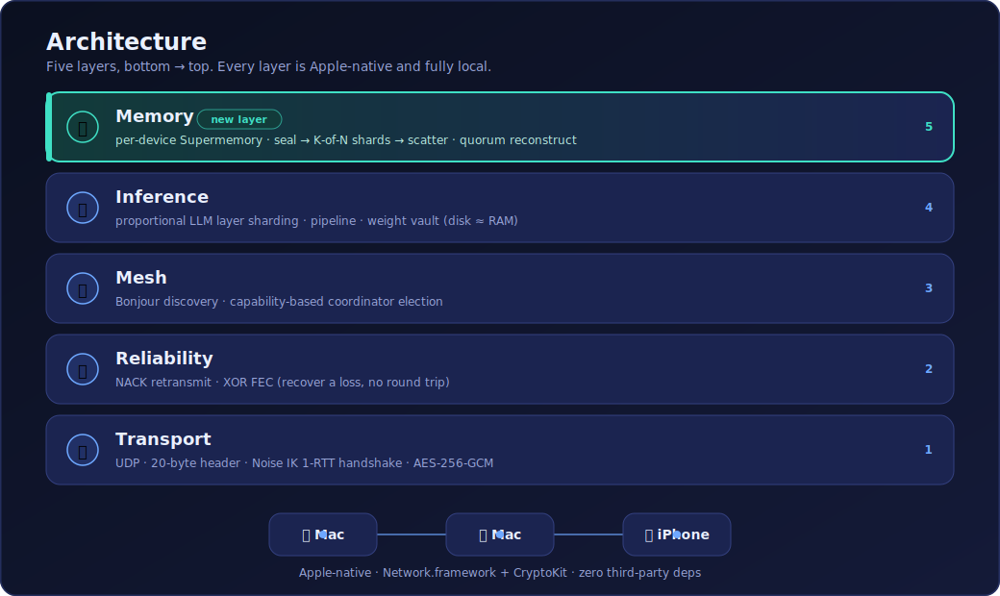

<div align="center">



# 🧠 NeuraMesh — Distributed AI, Meshed Across Your Devices

**Split a big LLM across your Apple devices, and give it a memory that survives losing one of them — 100% local, no cloud.**


</div>

> **NeuraMesh** is a fully-local, Apple-native protocol that turns the Apple devices you already own into one cooperative mesh. It does two things no single device can do alone: **run a language model bigger than any one device's RAM** by splitting its layers across peers, and **hold your AI's long-term memory** in a way that is private *and* resilient — sealed, erasure-coded, and scattered across your devices so that **no single device holds a complete readable copy** and losing one doesn't lose the memory.

---

## 🎬 The distributed-memory demo

<div align="center">



</div>

> *A memory is sealed, split into K-of-N shards, and scattered one per device. Kill a device (for real — `kill -9`) and a **quorum** of the survivors still reconstructs the exact original. No device ever held the whole thing.*

---

## 🤔 What is NeuraMesh?

You own a Mac, an iPhone, maybe an iPad. Each is powerful, but each is an island — and each is a single point of failure for anything private you keep on it.

**NeuraMesh meshes them into one system over your local Wi-Fi**, with its own encrypted transport (no cloud, no accounts, nothing leaves your LAN):

- **Run bigger models locally.** A 7B/13B model won't fit on a phone. NeuraMesh proportionally splits the model's transformer layers across your devices, so their *combined* RAM runs a model none of them could load alone — with real llama.cpp, producing byte-identical output to a single-machine run.
- **Give your AI a memory that can't be lost or read by one device.** Each device runs its own local [Supermemory](https://supermemory.ai) instance. Every memory is compressed, encrypted, split into erasure-coded shards, and one shard is sent to each device. Reconstructing the memory needs a **quorum** — so a lost/stolen/dead device neither loses your memory nor leaks a full copy of it.

It's built on a hand-rolled UDP protocol (Noise IK handshake, AES-256-GCM, XOR forward-error-correction, Bonjour discovery) that is measurably **the fastest *secure* transport** for this kind of chatty, latency-sensitive traffic — beating TLS and QUIC, and beating TCP's round-trip loss recovery under real Wi-Fi packet loss.

---

## ✨ Features

| | Feature | What it does |
|---|---|---|
| 🧠 | **Distributed memory** | Memories are sealed + K-of-N erasure-coded and scattered one shard per device — no single device holds a full copy |
| 🩹 | **Survives device loss** | Kill any one device; a quorum of survivors still reconstructs. Below quorum it fails *loudly*, never returns wrong data |
| 📦 | **Bigger-model sharding** | Splits an LLM's layers across devices so their combined RAM runs a model none could hold alone (bit-exact output) |
| 🔒 | **Encrypted P2P transport** | 1-RTT Noise IK handshake + per-session AES-256-GCM, static-key pinned — no certificates, no cloud |
| 🛰️ | **Zero-config discovery** | Bonjour/mDNS finds peers on the LAN and elects a coordinator automatically |
| ⚡ | **Loss recovery, no round trip** | XOR FEC rebuilds a dropped packet receiver-side — dodges TCP's head-of-line stall on lossy Wi-Fi |
| 📱 | **On-device iPhone backend** | The phone can't run the Node memory server, so it uses a native store (file blobs + Apple `NaturalLanguage` embeddings) — still no network |
| 📊 | **Live dashboard + PWA** | Real-time mesh view and a *measured* transport race (NMP vs TCP vs TLS vs QUIC) |

---

## 🧠 The distributed memory mesh (Supermemory)

Full design + honesty doc: [`Docs/Memory_Mesh.md`](Docs/Memory_Mesh.md) · iPhone backend: [`Docs/Memory_Mesh_iOS.md`](Docs/Memory_Mesh_iOS.md)

### Each device runs its own local Supermemory — never the cloud

Every device runs its **own self-hosted `supermemory-server`, bound to localhost**. This is enforced *in code*: `NMPSupermemoryConfig.init` **throws** unless the host is `localhost` / `127.0.0.1` / `::1`. The hosted endpoints (`console`/`api.supermemory.ai`) simply **cannot be configured**, and the setup script re-asserts that no config points at `supermemory.ai`. Your memories never touch a Supermemory cloud.

### Seal → shard → scatter — one shard per device

```
   "remember: launch is March 14"
                │
     🔒 Seal    │  LZFSE compress → AES-256-GCM encrypt (fresh 256-bit key)
                ▼
        ▓▓▓▓▓▓ opaque ciphertext (plaintext persisted NOWHERE)
                │
     ✂  Shard   │  K-of-N XOR erasure code   (e.g. 2-of-3)
                ▼
        ┌──────┬──────┬──────┐
        │  S0  │  S1  │  S2  │   ← any K of N reconstruct the original
        └──┬───┴──┬───┴──┬───┘
           ▼      ▼      ▼
        💻 Mac  💻 Mac  📱 iPhone     one opaque shard each, over encrypted NMP
```

**Reading** gathers **K** shards (its own + peers' over NMP), reconstructs, and decrypts. Below quorum it **fails loudly** — `HTTP 503 quorum_unavailable`, naming the unreachable peers — and never returns wrong output. AES-GCM's auth tag makes reconstruction **tamper-evident**.

### The guarantee — stated precisely and honestly

> **No single peer holds a COMPLETE readable copy; full content requires a K-of-N quorum of shards.**

To keep memories *semantically searchable* even after the author's device is gone, each peer also stores a small **plaintext index entry** (title + a bounded ~160-char snippet + the AES key + the roster). That is an honest tradeoff, stated plainly: because the index holds the key, a single peer *could* decrypt its own 1/K fragment and does see the bounded snippet — so **the quorum protects *completeness*, not secrecy against a key-holding peer.** It is deliberately **not** sold as threshold secrecy or zero-knowledge (that would need Shamir sharing, out of scope).

### The phone joins too

iOS can't run the Node `supermemory-server`, so the iPhone runs an **equivalent on-device store** — a file blob store plus Apple `NaturalLanguage` embeddings for semantic search (sentence → word-average → lexical fallback), **no network at all**. A single mesh can *mix* backends behind one `NMPMemoryStore` seam: Macs on Supermemory, a phone on the native store.

### Verified live

Measured this session: a mixed 3-peer mesh (two Macs on Supermemory + one peer on the native store) sharded a memory 2-of-3, then a peer was **killed with `kill -9`**, and a survivor reconstructed the full plaintext from its own shard plus the native-store peer's shard served over NMP. Kill a *second* peer (below quorum) and recall fails explicitly. Semantic recall confirmed end-to-end (measured similarity **0.71** for the target vs 0.48 unrelated; warm ingestion searchable **~1.2 s** after add). Codec + native store carry **29 passing unit tests** (17 shard + 12 native store).

---

## 🏗️ Architecture

<div align="center">



</div>

The stack, bottom to top — every layer is Apple-native (Network.framework + CryptoKit), zero third-party dependencies:

| Layer | What it provides |
|---|---|
| **Transport** | UDP · 20-byte big-endian header · 1-RTT Noise IK handshake · per-session AES-256-GCM with replay window |
| **Reliability** | NACK-only retransmission (64-packet ring) · XOR FEC over 4-packet groups (recover a loss with no round trip) · AWDL-aware traffic shaping |
| **Mesh** | Bonjour/mDNS zero-config discovery · capabilities in TXT records · deterministic coordinator election |
| **Inference** | proportional LLM layer sharding · pipeline walking · bit-exact verification · weight vault streams only a peer's layers (disk ≈ RAM) |
| **Memory** | per-device local Supermemory · seal → K-of-N shards → scatter over the encrypted mesh · quorum reconstruct |

---

## ⚡ How we beat TCP (and TLS, and QUIC)

**The claim, honestly scoped:** for the traffic distributed inference actually produces — many small, latency-sensitive per-token round trips — NMP is the **fastest *secure* transport**, and its NACK+FEC design beats TCP's head-of-line blocking under loss. The repo backs this with a **fully measured** four-leg transport race (`NMPTransportRace`): a real generation's exact traffic replayed over four real stacks on loopback, each doing a genuine handshake.

### Handshake latency — *measured, loopback*

| NMP (Noise IK) | TCP + TLS 1.3 | QUIC |
|:---:|:---:|:---:|
| **1.2 – 2.9 ms** | 20 – 26 ms | 8 – 12 ms |

*Source: `Docs/Project_Overview.md`.* One round trip, because peers already know each other's static keys — no certificate exchange.

### The transport race — *measured, 20 trials, p50 total time*

Lower is better. Traffic shapes come from real KV-cached mesh generations. *Source: `Docs/Protocol_Comparison.md`.*

| Shape | NMP | TCP *(no crypto)* | TCP + TLS 1.3 | QUIC |
|---|---:|---:|---:|---:|
| prefill-burst (one large trip) | **1.82 ms** | 0.53 ms | 17.72 ms | 8.75 ms |
| decode-32 (many small trips) | **4.65 ms** | 2.81 ms | 19.57 ms | 11.31 ms |
| decode-128 (many small trips) | **14.34 ms** | 6.68 ms | 28.75 ms | 19.86 ms |

**How to read this honestly:**

- ✅ **Against the encrypted transports — the real comparison — NMP wins decisively**, 1.4–10× faster than TLS/QUIC on every shape. NMP does per-packet AES-256-GCM just like they do, but its 1-RTT Noise IK + lean AEAD datagrams avoid the per-connection and per-record costs TLS/QUIC pay.
- ⚪ **Plain TCP is faster because it does *nothing*** — no encryption, no framing. It's the *floor*, shown to price exactly what NMP's security costs. You'd never ship inference over unauthenticated plaintext on a shared LAN.
- 🔬 **Loopback isolates protocol cost** — radio time is absent from every leg. The race refuses to *model* any leg it can't actually run.

### Why NMP pulls ahead under real loss

TCP (and TLS/QUIC over it) suffer **head-of-line blocking**: one dropped segment stalls everything behind it for a retransmit round trip. NMP uses **NACK-only retransmission + XOR FEC** — every 4 data packets carry 1 parity packet, so a single loss is rebuilt receiver-side with **no round trip at all**.

> Measured in isolation *(`Docs/Protocol_Comparison.md`)*: **FEC reconstructs a lost activation packet in ~0.17 ms vs ~10 ms for a NACK round trip** — the exact currency per-token inference can't spare.

---

## 📦 Run a bigger model than any one device can hold

A phone can't load a 7B model; a Mac + a phone together can. NeuraMesh assigns each peer a **contiguous range of the model's transformer layers** (proportional to each device's measured speed), then walks the activation vector through the pipeline — one real mesh round trip per token.

- **Weight vault:** a peer that holds no local model streams **only its assigned layers** from the coordinator and caches them on disk, so a device stores ≈ its share, not the whole model (**disk ≈ RAM**).
- **Bit-exact:** greedy sampling ⇒ the meshed output is byte-identical to a single-machine run — used as a correctness oracle throughout.
- **Measured** *(Llama-2-7B-Chat Q4_K_M, two-process UDP mesh, `Docs/Project_Overview.md` / `Docs/Phase8_Design.md`)*: **8.7 – 12.1 tok/s**, per-token p50 **≈ 68 ms**, output identical to the single-device baseline.

---

## 🧰 Tech Stack

| Layer | Technology |
|---|---|
| **Transport / crypto** | Swift · Network.framework · CryptoKit (Noise IK, AES-256-GCM) — **zero third-party deps** |
| **Inference** | llama.cpp via a `dlopen`'d C shim (never linked) · GGUF parsing/slicing |
| **Memory** | self-hosted `supermemory-server` (localhost) · on-device Apple `NaturalLanguage` embeddings |
| **Crypto codec** | XOR erasure coding · LZFSE compression · AES-256-GCM sealing |
| **Dashboard / PWA** | hand-rolled HTTP + RFC 6455 WebSocket on `NWListener` · React/TypeScript (built output committed) |
| **Apps** | macOS CLIs (`nmp-*`) · SwiftUI iOS peer app (`NeuraMeshPeer`) |

---

## 🚀 Getting started

### Prerequisites

- macOS 13+ with **Xcode 14.2+ / Swift 5.8+**
- (memory mesh) the local Supermemory binary — one command, no cloud:
  ```bash
  curl -fsSL https://supermemory.ai/install | bash    # installs ~/.supermemory/bin/supermemory-server
  ```
- (real LLM) `brew install llama.cpp` + a GGUF model in `~/models/`

### Build & test

```bash
git clone https://github.com/katsdivi/NeuraMesh-Protocol.git
cd NeuraMesh-Protocol
swift build
swift test                       # full suite — 474 tests, 0 failures
```

### Run the mesh dashboard

```bash
swift run nmp-dashboard           # simulated mesh + dashboard on :8080
swift run nmp-dashboard --ui      # + React UI on :3000 (LAN)
```

---

## ▶️ Running the distributed-memory demo

```bash
# 1. Stand up 3 independent local Supermemory instances + per-peer configs
scripts/setup_memory_mesh.sh start

# 2. Run the three memory peers (each holds ONE shard)
swift run nmp-memory-peer --config ~/.neuramesh-memdemo/peer1/config.json
swift run nmp-memory-peer --config ~/.neuramesh-memdemo/peer2/config.json
swift run nmp-memory-peer --config ~/.neuramesh-memdemo/peer3/config.json
#    …or run a peer on the native on-device backend (the exact code the iPhone uses):
#    swift run nmp-memory-peer --config …/peer3/config.json --local-store

# 3. Drive the kill-a-peer demo (or run the steps by hand)
scripts/run_memory_demo.sh --launch --kill-two
#    write a memory → prove 1 shard/peer → recall →
#    kill -9 a peer → recall SURVIVES from the quorum →
#    kill a 2nd peer → recall fails explicitly (503, never wrong)
```

### Run a real model split across two processes / devices

```bash
scripts/setup_llama.sh                                   # one-time: build the dlopen'd shim
# terminal 1 — the compute peer (weights live HERE):
swift run nmp-peer --engine llamaCpp --model ~/models/llama-2-7b-chat.Q4_K_M.gguf
# terminal 2 — the coordinator (tokenizer only):
swift run nmp-coordinator --engine llamaCpp --model ~/models/llama-2-7b-chat.Q4_K_M.gguf
```

**Cross-device (Mac + iPhone):** see [`Docs/CrossDevice_Setup_Guide.md`](Docs/CrossDevice_Setup_Guide.md) and [`Docs/Memory_Mesh_iOS.md`](Docs/Memory_Mesh_iOS.md).

---

## 📡 CLI & control reference

| Command / endpoint | What it does |
|---|---|
| `swift run nmp-dashboard [--ui]` | Simulated mesh + web dashboard / PWA |
| `swift run nmp-peer` | Compute peer (same runtime the iOS app embeds) |
| `swift run nmp-coordinator` | Coordinator + cross-device benchmark |
| `swift run nmp-memory-peer --config <json> [--local-store]` | Distributed-memory peer (Supermemory or on-device backend) |
| `POST /remember {content,title}` | Seal + shard + scatter a memory across peers |
| `GET /recall?q=<query>` | Semantic recall → gather K shards → reconstruct |
| `GET /status` · `GET /memories` | Peer + link + store status; indexed memories |
| `scripts/setup_memory_mesh.sh {start\|stop\|status}` | Manage the 3-instance demo environment |

---

## 📁 Project structure

```
NeuraMesh-Protocol/
├── Sources/NMP/                     # the protocol library (Apple-native, zero deps)
│   ├── NoiseIK · SymmetricCrypto · PacketCodec · UDPTransport   # transport + crypto
│   ├── Reliability · FECCodec · FECGroup                        # NACK + XOR FEC
│   ├── Bonjour · CoordinatorElection · PeerDiscoveryManager     # mesh assembly
│   ├── ModelSharder · InferenceOrchestrator · LlamaShard*       # LLM layer sharding
│   ├── NMPMemoryShard · NMPMemorySeal                           # K-of-N codec + sealing
│   ├── NMPMemoryStore · NMPSupermemoryClient · NMPLocalMemoryStore  # backend seam
│   └── NMPMemoryMeshNode · NMPMemoryWire                        # the memory peer
├── Sources/NMP{Peer,Coordinator,Dashboard,MemoryPeer}CLI/       # the nmp-* executables
├── Tests/NMPTests/                  # 474 tests
├── NeuraMeshPeer/                   # SwiftUI iOS peer app (+ MemoryPeerController)
├── scripts/                         # setup_memory_mesh.sh · run_memory_demo.sh · setup_llama.sh
├── web/  ·  Public/                 # React dashboard source + committed build
└── Docs/                           # design + honesty docs (see index below)
```

---

## 🧪 Status & tests

- **474 tests, 0 failures** (measured this session) — the whole mesh runs in-process over a real loopback with real crypto/FEC/NACK, so tests exercise the actual protocol.
- Apple-native only: **no async/await**, **zero SwiftPM dependencies**, llama.cpp bound via a `dlopen`'d shim (never linked).
- Honest measurement: every number is labeled **measured** vs **modeled** in code, UI, and docs.

---

## 📚 Documentation

| Doc | About |
|---|---|
| [`Docs/Memory_Mesh.md`](Docs/Memory_Mesh.md) | The distributed memory mesh — design, the searchable-index tradeoff, pre-existing vs new |
| [`Docs/Memory_Mesh_iOS.md`](Docs/Memory_Mesh_iOS.md) | The on-device iPhone backend + manual Xcode integration |
| [`Docs/Project_Overview.md`](Docs/Project_Overview.md) | The whole project + measured results |
| [`Docs/Protocol_Comparison.md`](Docs/Protocol_Comparison.md) | The measured NMP vs TCP/TLS/QUIC transport race |
| [`Docs/Start_Here.md`](Docs/Start_Here.md) | Operator's manual — every mode, how to test each feature |
| [`Docs/CrossDevice_Setup_Guide.md`](Docs/CrossDevice_Setup_Guide.md) | Run the mesh on your Mac + iPhone |
| [`NOTE_TO_JUDGES.md`](NOTE_TO_JUDGES.md) | Honest note on what was built during the hackathon |

---

<div align="center">

Made with 🤍 by Divyam Kataria

</div>
